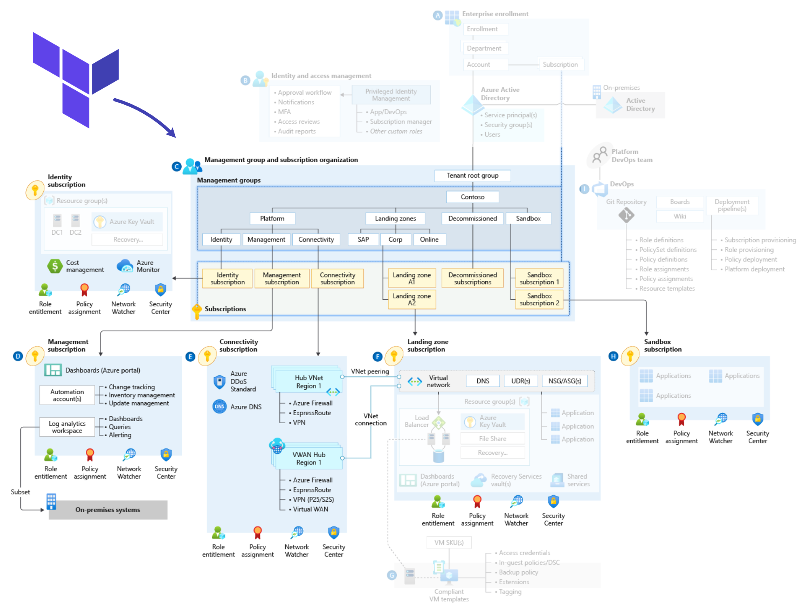

# Azure Landing Zones Terraform Module

> ⚠️ **Important**  
> For new deployments, we recommend using the [Azure Verified Modules for Platform Landing Zones](https://aka.ms/alz/tf).  
> This module will continue to be supported for **existing deployments**.

---

## 🔧 Build Status

| Release | Issue Resolution Time | Open Issues % | OpenSSF Scorecard |
|---------|------------------------|---------------|--------------------|
|  | ⏱️ Avg: _X days_ | ✅ _Y% Closed_ | 🔒 _Z/10_ |

---

## 📘 Documentation

Refer to the [Wiki](https://github.com/sre-world/terraform-landing-zone-core/wiki) for full details:

- [🏠 Home](https://github.com/sre-world/terraform-landing-zone-core/wiki)
- [📖 User Guide](https://github.com/sre-world/terraform-landing-zone-core/wiki/User-Guide)
- [💡 Examples](https://github.com/sre-world/terraform-landing-zone-core/wiki/Examples)
  - [Example 1: Minimal Configuration](https://github.com/sre-world/terraform-landing-zone-core/wiki/Example-1-Minimal-Configuration)
  - [Example 2: Archetype Overrides](https://github.com/sre-world/terraform-landing-zone-core/wiki/Example-2-Archetype-Overrides)
  - [Example 3: Subscription Onboarding](https://github.com/sre-world/terraform-landing-zone-core/wiki/Example-3-Subscription-Onboarding)
- [❓ Frequently Asked Questions](https://github.com/sre-world/terraform-landing-zone-core/wiki/Frequently-Asked-Questions)
- [🛠️ Troubleshooting](https://github.com/sre-world/terraform-landing-zone-core/wiki/Troubleshooting)

---

# ⚠️ Breaking Changes Notice

## Effective: Q4 2024 (Now Active)

As of Q4 2024, this module now **defaults to deploying zone-redundant SKUs** for the following Azure resources:

- Azure Firewall
- Public IP
- Virtual Network Gateway

## 🔍 What This Means

- Existing configurations without explicit settings may now deploy **ZRS (Zone-Redundant SKU)** variants.
- This could cause **re-deployment of existing resources** if state drift occurs.

## ✔️ What You Should Do

- **Explicitly set** SKUs in your configuration to match your environment if you want to prevent changes.
- Use `terraform plan` carefully before applying in production.
- Refer to the [Migration Guide](https://aka.ms/alz/tf/migration-guide) for mitigation steps.
---

## 📌 Overview

This Terraform module helps deploy **Azure Landing Zones** based on Microsoft’s [Cloud Adoption Framework](https://learn.microsoft.com/en-us/azure/cloud-adoption-framework/landing-zones/) and **Enterprise-Scale architecture**.

It supports standardized, secure, and scalable deployment of:

- 🌐 Management Group Hierarchies
- 📜 Azure Policies and Initiatives
- 🔒 Diagnostic Settings and Logging
- 📊 Log Analytics and Monitoring Integrations
- 🧱 Hub & Spoke Network Topology

---
## 🧭 Architecture

A conceptual architecture diagram highlighting the design areas covered by the Azure landing zones Terraform module:

---

## 📂 Repo Structure (Sample)

